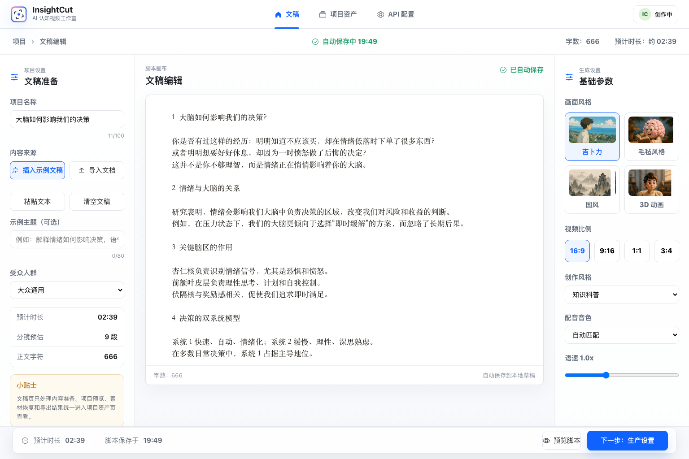
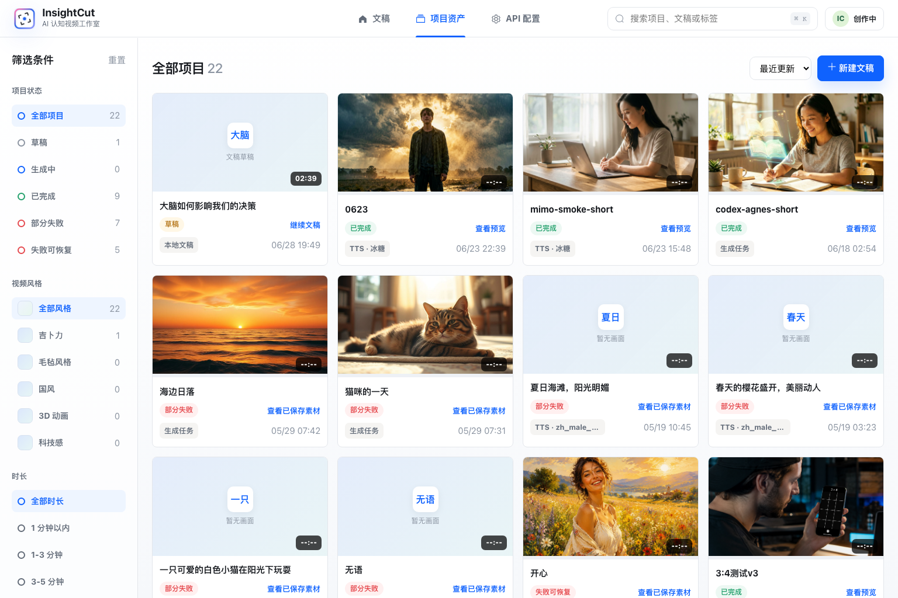
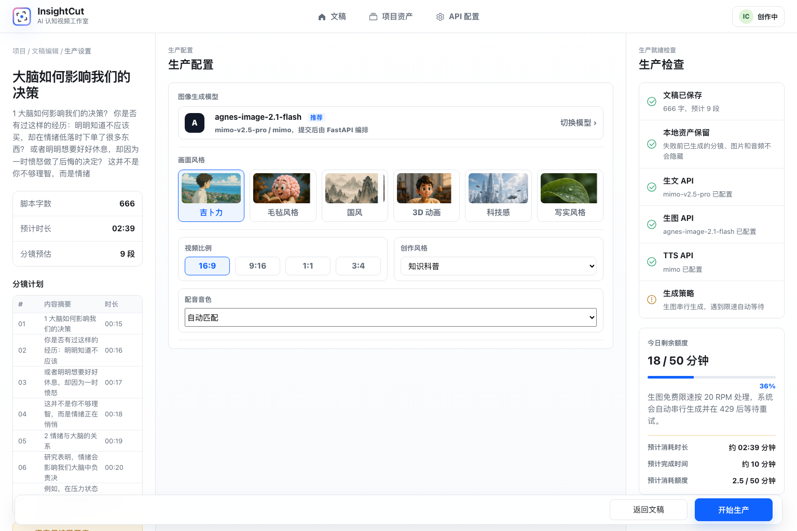
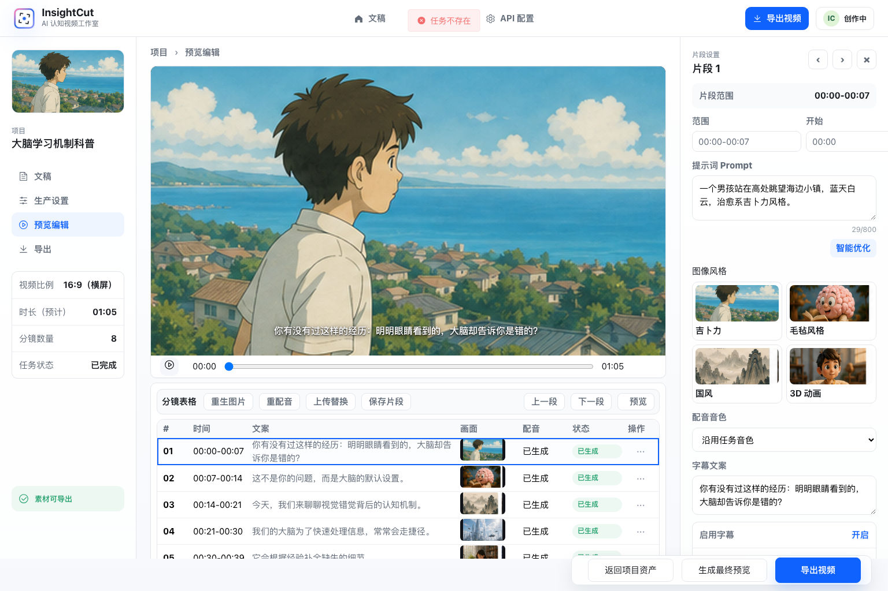
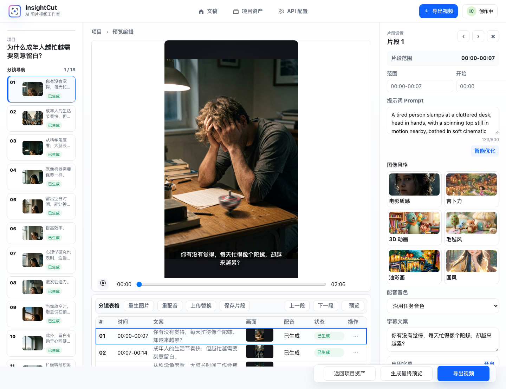
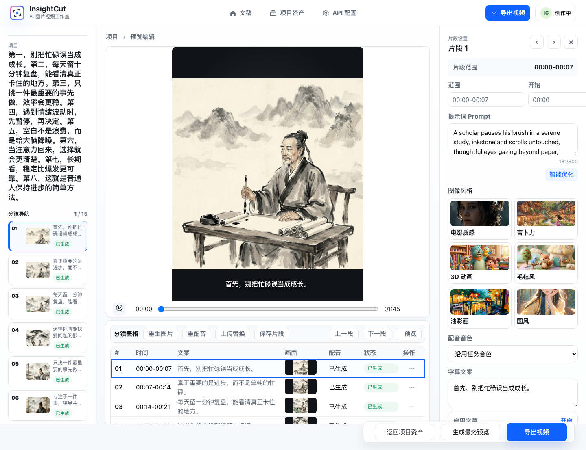

# InsightCut

> All in one, 但不是画布；生成效果远胜剪映的一键成片。

InsightCut is a local-first AI video production workbench for explainer, knowledge, commentary, and short-form education videos. It turns a topic or manuscript into a structured video project: script, storyboard, AI images, TTS voiceover, subtitles, preview editing, MP4 export, and Jianying / CapCut draft export.

InsightCut 的核心价值不是“给你一个复杂画布再从零剪辑”，而是把知识视频里最重复、最耗时、最容易断链的生产流程收成一条可恢复、可修改、可导出的工作流。它追求的不是模板化的一键拼接，而是让默认生成出来的画面、分镜、配音、字幕和导出结果，整体效果远胜剪映的一键成片。



## Keywords

`AI video generation` · `AI explainer video` · `local-first video workflow` · `storyboard editor` · `image generation` · `TTS voiceover` · `subtitle generation` · `MP4 export` · `Jianying draft` · `CapCut draft` · `FastAPI` · `Vue 3` · `Vite` · `FFmpeg`

中文关键词：`AI 视频生成`、`AI 解说视频`、`知识视频工作台`、`科普视频生成`、`文稿转视频`、`分镜编辑`、`剪映草稿导出`、`本地优先素材管理`。

## Why

很多创作者有观点、有文稿、有表达欲，但视频生产链路很长：

```text
选题 / 文稿
  -> 脚本整理
  -> 分镜拆解
  -> 图片生成
  -> 配音
  -> 字幕
  -> 预览检查
  -> MP4 / 剪映草稿导出
```

普通“一键成片”经常只给一个结果文件，失败后素材消失，想修改也只能重来；剪映的一键成片虽然足够快，但默认结果容易模板化、素材不可控、二次修改链路短。InsightCut 的目标是让默认生成效果远胜剪映的一键成片，同时保留完整中间资产。它的设计原则是：

- Every intermediate asset is visible.
- Every generated segment can be edited.
- Failed tasks must preserve generated assets.
- MP4 is not the only output; editable Jianying / CapCut drafts matter.

也就是说，InsightCut 不是一次性生成器，而是一个可以继续判断、替换、重生成和导出的 AI 视频生产工作台。

## Product Screenshots

| Manuscript | Assets |
| --- | --- |
|  |  |

| Production Setup | Preview Editor |
| --- | --- |
|  |  |

| 9:16 Preview | 3:4 Preview |
| --- | --- |
|  |  |

## Core Workflow

1. **Write or import manuscript**
   - Theme mode: enter a short topic and expand it during production.
   - Input mode: paste or import a complete manuscript.

2. **Configure production**
   - Visual style, aspect ratio, writing style, and TTS voice.
   - API readiness checks for LLM, image generation, and TTS.

3. **Generate video assets**
   - Script processing.
   - Storyboard segmentation.
   - Image prompt generation.
   - AI image generation.
   - TTS voiceover.
   - Subtitles and basic motion.

4. **Preview and recover**
   - Inspect every segment.
   - Edit subtitle text and image prompts.
   - Regenerate image or voiceover per segment.
   - Upload replacement image.
   - Recover usable assets even when a task partially fails.

5. **Export**
   - MP4 for quick review, publishing, or internal delivery.
   - Jianying / CapCut draft ZIP for further editing.

## Key Features

### Manuscript-first homepage

The homepage is the manuscript workspace, not a project library. The product starts where the creator starts: the idea, topic, or draft.

### Editable storyboard assets

Each generated segment keeps its own text, image prompt, image, audio, status, and history. This makes the generated video auditable and repairable.

### Recoverable failures

Generation failure is not treated as a dead end. Already generated scripts, images, audio, subtitles, and draft files are still shown in the asset and preview flows.

### Real export center

The export page is the single delivery center. It separates MP4 availability from Jianying / CapCut draft availability, so users do not see fake “ready” states.

### Local-first storage

Data, media, config, and logs are stored locally by default. This makes the system practical for experimentation, debugging, and private creator workflows.

## Outputs

- MP4 video with image, voiceover, subtitles, and basic motion.
- Jianying / CapCut draft ZIP.
- Storyboard segment table.
- Generated images.
- TTS audio files.
- Subtitle SRT.
- Project and asset records for recovery and reuse.

## Tech Stack

| Layer | Stack |
| --- | --- |
| Frontend | Vue 3, Vite, Element Plus |
| Backend | FastAPI, Python |
| Database | Local SQLite |
| Text generation | LiteLLM-compatible LLM providers |
| Image generation | Agnes Image 2.1 Flash / OpenAI-compatible image API |
| TTS | Doubao TTS, Xiaomi MiMo TTS |
| Video export | FFmpeg |
| Editable draft export | pyJianYingDraft |
| Storage | Local media directories |

## Repository Structure

```text
Auto-jianji/
├── ai-kepu-video-server/          # FastAPI backend
│   ├── api_server.py              # API entry
│   ├── src/                       # pipeline, media, draft, export, API modules
│   ├── data/                      # local SQLite and media, ignored by git
│   └── output/                    # generated project output, ignored by git
├── ai-kepu-video-web/frontend/    # Vue 3 + Vite frontend
├── docs/                          # PRD and functional audit
├── design-qa-artifacts/           # current product screenshots
└── scripts/                       # QA capture scripts
```

## Local Development

Default ports:

- Frontend: `http://localhost:2001`
- Backend: `http://localhost:2002`
- API docs: `http://localhost:2002/docs`

### Start Backend

```bash
cd ai-kepu-video-server
source venv/bin/activate
python -m uvicorn api_server:app --host 0.0.0.0 --port 2002 --reload
```

### Start Frontend

```bash
cd ai-kepu-video-web/frontend
npm install
npm run dev
```

### Build / Check

```bash
cd ai-kepu-video-server
source venv/bin/activate
python -m compileall src api_server.py

cd ../ai-kepu-video-web/frontend
npm run build
```

## Configuration

Runtime model configuration is managed locally. The frontend API settings page can configure:

- LLM protocol, base URL, API key, and model.
- Image generation API URL, API key, and model.
- TTS provider and voice settings.

Local runtime files are intentionally ignored:

- `.env`
- `data/`
- `output/`
- `logs/`
- generated media and real API keys

## Documentation

- [Product Redesign PRD](docs/insightcut-redesign-prd.md)
- [Functional Audit](docs/insightcut-functional-audit.md)
- [Design QA Notes](design-qa.md)

## Status

InsightCut is an active local-first product prototype. The current version focuses on a complete single-user workflow:

- manuscript preparation
- project assets
- API configuration
- production setup
- generation progress
- preview editing
- export center
- failure recovery

Not included in v1 scope: collaboration, cloud billing, multi-tenant user management, template marketplace, and hosted media storage.

## License

No license has been declared yet. Treat this repository as source-available unless a license is added.
